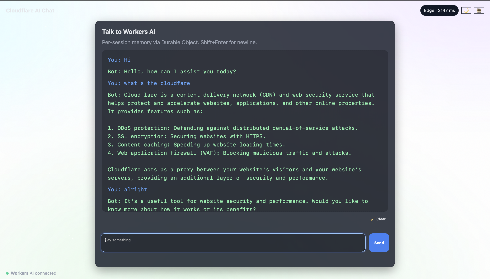

# Cloudflare AI Chat ✨
An AI chat app built with **Cloudflare Workers** + **Workers AI**, featuring per-session memory via Durable Objects and a modern interactive UI (animated background + dark/light theme toggle).

## Badges

[](#license)
[](#)
[](#)
[](#)

## 🚀 Live Demo
https://cf-ai-edge-chat.niaznas8.workers.dev

## 🖼️ Screenshot

Here’s what **Cloudflare AI Chat** looks like in action:



> 🔎 Tip: You can update the screenshot anytime to show new features like dark mode, background animations, or theme toggle.


## ⭐ Highlights
- 🧠 LLM: Workers AI `@cf/meta/llama-3.1-8b-instruct`
- ⚙️ Worker routes: `/api/chat`, `/health`
- 🗄️ Durable Object memory (SQLite on Free plan)
- 🎨 Animated gradient + particles background; dark/light toggle
- 💾 Per-session memory (keeps last N turns)


## ⚡ Quick Deploy
-
    npm install
-
    npm run deploy

## 📚 API Reference

**POST `/api/chat`**  
Loads prior turns, calls Workers AI, saves the new turn, returns:
{ "reply": "..." }

**GET `/health`**  
Returns: ok

**Durable Object (internal RPC)**  
- `POST do:/load` → returns chat history  
- `POST do:/save` → body `{ user, assistant, cap }` (trims to last N turns)


## 🧭 How It Works

```text
Browser (index.html)
   → POST /api/chat { message }
   ↓
Worker (src/index.ts)
   • Load history from Durable Object
   • Call Workers AI (messages API)
   • Save turn back to Durable Object
   ↓
Durable Object (src/memory.ts)
   • /load → { messages }
   • /save → trims to last N turns
```
## 🗂️ Project Structure
```text
public/index.html     # chat UI with animated background + theme toggle
src/index.ts          # Worker routes + AI call
src/memory.ts         # Durable Object for memory (SQLite)
wrangler.toml         # Worker + DO bindings/migration
PROMPTS.md            # development prompts (assignment requirement)
package.json          # scripts (deploy, dev)
tsconfig.json         # TypeScript config
```

## ✅ Assignment Checklist
- [x] LLM (Workers AI)
- [x] Workflow/coordination (Worker)
- [x] User input (chat UI)
- [x] Memory/state (Durable Object)
- [x] Repo prefix `cf_ai_edge_chat`
- [x] README with deploy steps + live link
- [x] PROMPTS.md

## 📌 Notes
- Memory is capped to the last **20 turns** per session.  
- Default model: `@cf/meta/llama-3.1-8b-instruct` (swap to `@cf/meta/llama-3.2-3b-instruct` for lower latency).  
- Uses **SQLite Durable Objects** on Free plan (via migration in `wrangler.toml`).

## ⚖️ License

MIT License  

Copyright (c) 2025 Anas Niaz  

Permission is hereby granted, free of charge, to any person obtaining a copy
of this software and associated documentation files (the “Software”), to deal
in the Software without restriction, including without limitation the rights
to use, copy, modify, merge, publish, distribute, sublicense, and/or sell
copies of the Software, and to permit persons to whom the Software is
furnished to do so, subject to the following conditions:

The above copyright notice and this permission notice shall be included in
all copies or substantial portions of the Software.

THE SOFTWARE IS PROVIDED “AS IS”, WITHOUT WARRANTY OF ANY KIND, EXPRESS OR
IMPLIED, INCLUDING BUT NOT LIMITED TO THE WARRANTIES OF MERCHANTABILITY,
FITNESS FOR A PARTICULAR PURPOSE AND NONINFRINGEMENT. IN NO EVENT SHALL THE
AUTHORS OR COPYRIGHT HOLDERS BE LIABLE FOR ANY CLAIM, DAMAGES OR OTHER
LIABILITY, WHETHER IN AN ACTION OF CONTRACT, TORT OR OTHERWISE, ARISING FROM,
OUT OF OR IN CONNECTION WITH THE SOFTWARE OR THE USE OR OTHER DEALINGS IN
THE SOFTWARE.

## 🚀 About Me

I’m a **Software Engineer** with a strong foundation in computer science and hands-on experience building **scalable web applications**, **cloud-native services**, and **AI-powered projects**.  

- 💻 Skilled in **JavaScript/TypeScript, Python, and C++**  
- ⚡ Experienced with **Cloudflare Workers, Durable Objects, REST APIs, and CI/CD pipelines**  
- 🧠 Academic background in **AI/ML** with projects in natural language processing and real-time systems  
- 🌐 Passionate about **building performant, reliable systems** that run at internet scale  
- 🎯 Career goal: to grow as a backend/full-stack engineer while contributing to products that make technology more **accessible, efficient, and secure**


